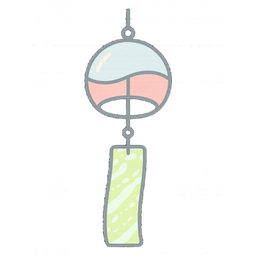

# Dreamcatcher 🎐
Locally hosted Discord bot for keeping up with content creator's socials and streams.

## Features
- Scalable real-time YouTube, Twitch and Bluesky channel activity monitoring that respects API quotas
- SQLite Database for content tracking and managing multi-server functionality.
- Individual Discord channel settings

## Design Highlights
- Fully asynchronous
- Modern Discord bot features using cogs and slash commands
- Error handling with retry/backoff for failed API calls

## Prerequisites
- Discord, Google and Twitch Developer access
- Python 3.8+
- pip

## Getting Started
1. Setup Discord Bot:
	- Create a new application inside [Discord Developer Portal](https://discord.com/developers/applications)
	- Save generated bot token to the `.env` file (use `.env.example` as reference)
	- Set up a new Discord server for your bot's development/home channel.
2. Setup API accesses:
	- Create New [Google Cloud Console project](https://console.cloud.google.com)
	- Enable YouTube Data API 3.0.
	- Create API Credentials and save them into the `.env` file.
 	- Register a new [Twitch application](https://dev.twitch.tv/console/apps)
  	- Copy the Client ID keys to the `.env` file.
4. Run the app:
	- Install required libraries:
		`pip install -r requirements.txt`
	- Run the bot with either:
		`python source/main.py` or `./dreamcatcher`
	- Use `/Sync` command to synchronize bot's slash commands with discord.
	- Use available slash commands to define bot activity.

